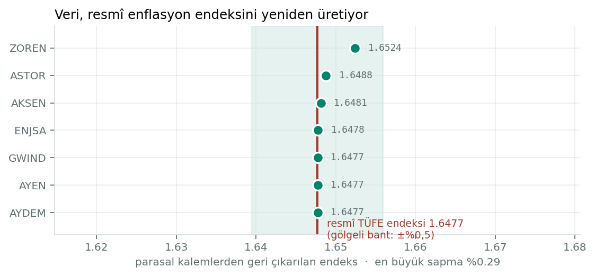
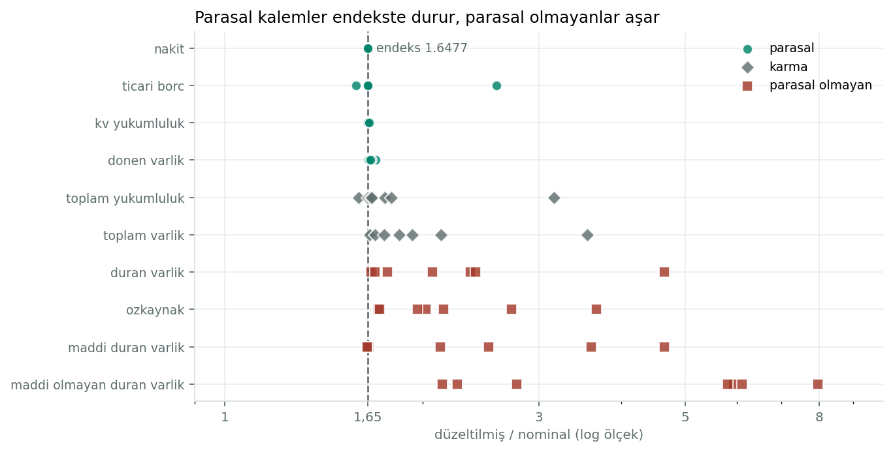
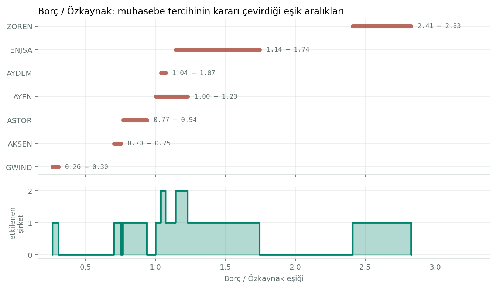
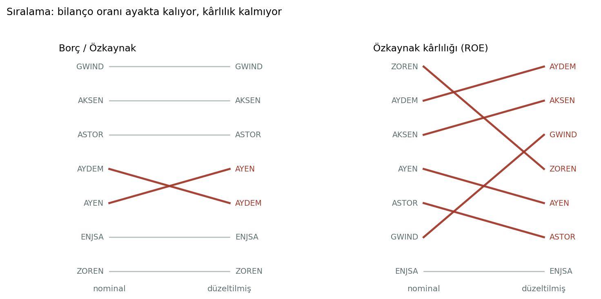

# tms29 — What hyperinflation accounting does to financial ratios

[](https://github.com/beratylmz/tms29/actions/workflows/ci.yml)

Turkey crossed the hyperinflation threshold and, from the 2023 reporting period,
listed companies had to restate their financial statements under **TAS 29 /
IAS 29**. That means the same balance sheet exists twice: as originally reported
in nominal lira, and restated into current purchasing power.

This repository asks one question of that natural experiment:

> **Does the restatement change the answers a credit analyst would get?**

Seven BIST-listed energy companies, 2020–2025, hand-extracted from audited KAP
filings. 60 tests, 95% coverage, no network access required.

> **A note on language.** The README is in English; the code comments and
> docstrings are in Turkish. That is deliberate rather than careless — the
> subject is Turkish accounting regulation, the source documents are Turkish,
> and the reasoning was done in Turkish. The shop window is English; the
> workshop is not.

---

## The short answer

**It depends entirely on which ratio you look at — and the pattern is
mechanical, not arbitrary.**

| Ratio | Rank correlation (nominal → restated) | Pairs that swap | Thresholds where at least one credit decision flips |
|---|---|---|---|
| Current ratio | **1.000** | 0 / 21 | **1.6%** |
| Debt / Equity | 0.964 | 1 / 21 | **55.4%** |
| Equity / Assets | 0.964 | 1 / 21 | 48.8% |
| Return on equity | 0.607 | 5 / 21 | 99.9% |
| Net profit margin | 0.571 | 6 / 21 | 97.6% |

Three things follow.

**1. Liquidity is untouched.** Current assets and current liabilities are both
predominantly *monetary*, so they are restated by the same index and the ratio
survives intact. This was a prediction of the mechanism before it was a result.

**2. Leverage keeps its ranking but loses its thresholds.** Every company's
debt-to-equity falls under restatement — without exception — but by wildly
different amounts (−3.1% to −34.4%). The *order* barely changes. What changes is
whether a company clears a fixed cut-off.

**3. Profitability is not merely rescaled — it is rebuilt.** The balance sheet
restatement re-measures existing items. The income statement gets an item that
did not exist before: the net monetary position gain or loss. Rankings collapse.

---

## The validation anchor

Before trusting any of the above, the measurement instrument has to be checked
against something known from outside the data.

Monetary items — cash, payables, short-term liabilities — are by definition
restated only from the balance sheet date. Their uplift factor must therefore
equal the official CPI index ratio. So the inflation index can be **recovered
from the financial statements** and compared with the published figure.



Seven companies, seven separate audit reports, extracted by hand — and every one
reproduces the official index. TurkStat reported 2023 annual CPI inflation of
**64.77%**, an index ratio of 1.6477. The data implies 1.6486, a deviation of
**0.055%**. Four of the seven match to four decimal places.

There is a second, opposite check. Restating between two *already restated*
price levels (2023 lira → 2024 lira) is a uniform multiplication and must leave
every ratio unchanged. It does, to within 0.3%. Both tests are in the suite: one
says "nothing should move", the other says "something must move". Without the
second, an instrument that returned constants would pass.

---

## The mechanism

TAS 29 does not scale a balance sheet up. It changes its **composition**.
Monetary items are indexed from the balance sheet date; non-monetary items from
their acquisition date, which is much earlier.



Monetary items sit on the index. Non-monetary items overshoot it, and by how
much depends on how old the assets are — property, plant and equipment ranges
from 1.6× to 4.6× across these seven firms. That spread is why leverage ratios
move at all, and why they move by different amounts for different companies.

One exception worth naming: **paid-in capital is not restated** (factor exactly
1.000 for all seven). Under Turkish practice the adjustment accumulates in a
separate equity line, "capital adjustment differences". Three of the seven
already carried a balance there in nominal terms — a residue of Turkey's earlier
inflation accounting episode in 2003–2004.

---

## Thresholds, without cherry-picking

Saying "at a threshold of 1.5, company X flips" invites the obvious objection:
you chose 1.5 because it flipped. So no threshold is chosen. The entire
threshold space is swept.

The mechanics are simple. If a company's ratio is *a* nominally and *b* after
restatement, then **every** threshold between them reverses that company's
outcome. The union of those intervals is the region where the accounting basis
changes at least one decision.



For debt-to-equity, that region covers **55.4%** of the observed range. ENJSA's
interval alone runs from 1.14 to 1.75 — it contains 1.5, a common covenant
level, but the finding does not depend on that coincidence.

For the current ratio the same sweep gives **1.6%**. The contrast is the point.

---

## Where the ranking actually breaks



Left: one swap. Right: five. The difference is the income statement.

Under nominal accounting there is no line for the gain or loss on a company's
net monetary position. Under TAS 29 there is, and it is large. ZOREN — the most
leveraged firm here — reports net income of ₺40.0m nominally and ₺9,508.7m
restated, a **238×** increase, because inflation erodes its debt in real terms
and that gain is now recognised.

The effect tracks the monetary position, not leverage as such:

| | Spearman ρ | p | n |
|---|---|---|---|
| Leverage ↔ profit uplift | +0.714 | 0.071 | 7 |
| **Monetary gain / equity ↔ profit uplift** | **+0.857** | **0.014** | 7 |

And there is a clean counterexample against the shortcut "leveraged firms gain
from inflation": **ENJSA is highly leveraged (D/E 1.75) and reports a monetary
loss of ₺5.9bn.** Its concession financial assets under IFRIC 12 — ₺15.1bn of
them — are monetary receivables, which leave it a net monetary *creditor*
despite the debt. That case is locked in a test.

The mirror image is ASTOR, the most conservative balance sheet in the sample,
cash-rich with negative net debt. Holding cash through inflation is a real loss,
and restatement charges it ₺1.0bn for the privilege.

**For credit work the sentence is:** inflation accounting makes the most
leveraged company look the most improved.

---

## What is in here

```
src/tms29/
  kavramlar.py   Terminology: price level, monetary vs non-monetary, block types
  cikar.py       Lossless extraction from the source workbook
  kalemler.py    Raw labels → canonical items (explicit table, table-scoped)
  dogrula.py     Accounting identities
  oranlar.py     Ratio engine — blind to price level by construction
  etki.py        Uplift factors, implied index, monetary position effect
  siralama.py    Rank shift, threshold sweep
  grafik.py      Charts (matplotlib — not a core dependency)
veri/
  kaynak_fsa.xlsx      The original workbook
  ham_cikarim.csv.gz   Frozen extraction, reproducible from the source by test
```

```bash
pip install -e ".[dev]"    # core + test tooling
pytest                     # 60 tests, no network, ~3 seconds
python docs/grafikleri_uret.py   # regenerate the four charts
```

### Three design decisions

**Extraction never interprets.** The extractor produces a long-format table with
raw labels intact; mapping to canonical names is a separate, tested layer. Where
extraction and interpretation share a function is where data loss goes unnoticed.

**The label table is explicit, never fuzzy.** "TOPLAM YÜKÜMLÜLÜKLER" and "TOPLAM
YÜKÜMLÜLÜKLER VE ÖZKAYNAKLAR" differ by two words and are entirely different
quantities. A similarity score that confuses them raises no error — it just
breaks the balance sheet identity quietly. Mapping is also scoped by statement,
because "monetary position" means one thing in the income statement and another
in the cash flow statement.

**Ratios do not know the price level.** No branch anywhere asks whether a figure
is restated. If there were one, part of the measured difference would be coming
from this code rather than from the accounting.

### The trap that was nearly missed

Each statement in the source workbook appears **twice**: once in thousands of
lira, once as common-size percentages. The two blocks carry **identical column
headers**. De-duplicating on the header would have hidden the second block
entirely, and if the block order were reversed on any sheet, percentages would
have been read as lira — silently. Columns are therefore classified by magnitude,
not by header, and a test locks it.

---

## Limits

- **21 measurable company-years** (7 firms × 2022–2024, each at two price
  levels). Every correlation reported here carries n = 7. They are direction
  indicators, not hypothesis tests, and the one significant result (p = 0.014)
  should be read with that sample in mind.
- **One sector, one country, one transition.** Energy firms in Turkey crossing
  into TAS 29. Asset-heavy by nature, so the monetary/non-monetary spread is
  probably wider here than in, say, services.
- **No default events.** With zero defaults in the sample, nothing here can
  support a probability-of-default model, and none is attempted.
- **Two unexplained observations, flagged not fixed.** GWIND and ZOREN trade
  payables deviate from the index (+56.9% and −4.2%) where a monetary item
  should not. Most likely reclassification between the two presentations; not
  resolvable from the filings alone, so they are reported rather than smoothed.
- **One labelling oddity.** ENJSA's 2022 cash flow column is tagged as restated
  where the others are nominal. It affects 58 rows in a statement this analysis
  does not use, and it was left as found.
- **Extraction is manual.** The underlying figures were typed from audited PDFs.
  The accounting identities all hold across 64 statement-columns, and the
  implied index matches the official one, which is evidence — not proof.

## Source

Consolidated audited financial statements published on KAP (Public Disclosure
Platform) for GWIND, ASTOR, AKSEN, ENJSA, AYDEM, ZOREN and AYEN. Inflation
figures from TurkStat (TÜİK) Consumer Price Index, December 2023 bulletin.

Originally a financial statement analysis course project, extended into a
measured study of what the restatement does.
